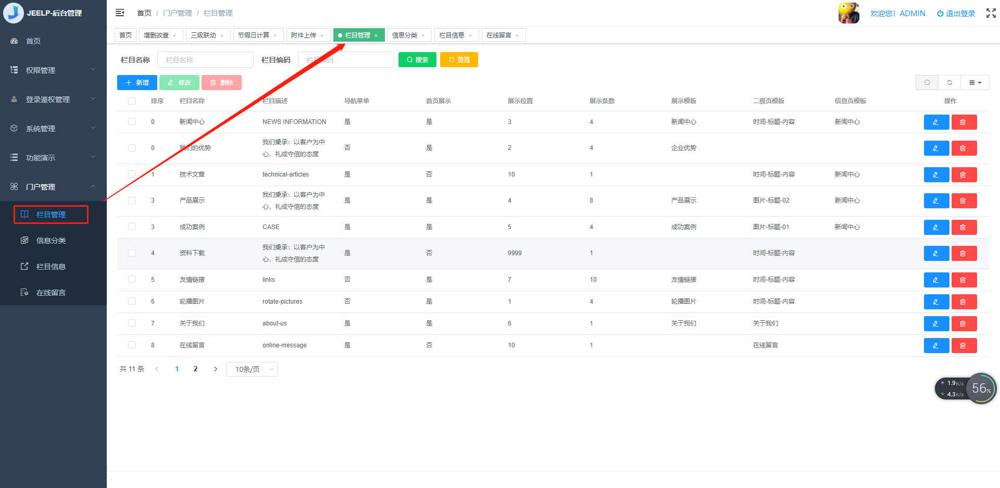
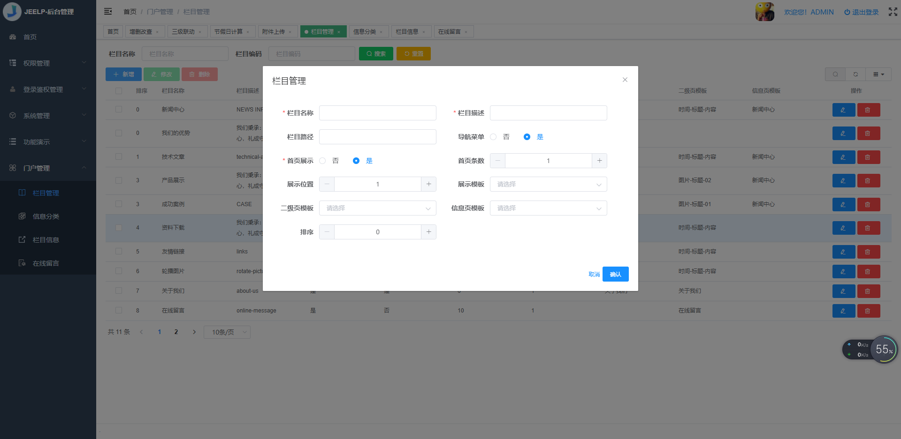

# 栏目管理
维护门户网站上不同的栏目，栏目可分为【导航栏目】和【首页栏目】。
* 导航栏目：可在门户网站导航位置显示栏目名称，点击栏目，可跳转到该栏目的二级界面。
<br/>
目前导航栏目：【新闻中心】,【技术文章】,【产品展示】,【成功案例】,【资料下载】,【关于我们】,【在线留言】,【联系我们】
<br/>
目前首页栏目：【图片轮播】,【我们的优势】,【新闻中心】,【产品展示】,【成功案例】，【关于我们】,【友情链接】
* 后台代码结构
```
com.jeelp.protal.modules.admin
   .entity
        .Topic.java                         栏目管理数据库映射实体
   .mapper
        .TopicMapper.java                   栏目管理mybaits mapper 映射接口
        .TopicMapper.xml                    栏目管理mybaits mapper 映射xml
   .rest
        .TopicController.java               栏目管理spring mvc 控制器
   .service  
        .impl       
            .TopicServiceImpl.java          栏目管理service 服务实现类
        .TopicService.java                  栏目管理service 服务接口
```
* 前台代码结构
```
src
    api
        pt01admin
            topic-api.js                    栏目管理后端请求api
    views
        pt01admin
            topic
                topic-form.vue              栏目管理表单界面
                topic-page.vue              栏目管理列表界面
                topic-index.vue             栏目管理菜单跳转界面
```
* 前后端交换接口说明
    * 后端 TopicController.java 
    ```
        package com.jeelp.protal.modules.admin.rest;
        
        import com.jeelp.platform.common.logging.annotation.Log;
        import com.jeelp.platform.common.mybatis.model.SaveModel;
        import com.jeelp.platform.common.mybatis.model.TabPage;
        import com.jeelp.protal.modules.admin.entity.Topic;
        import com.jeelp.protal.modules.admin.service.TopicService;
        import org.springframework.http.HttpStatus;
        import org.springframework.http.ResponseEntity;
        import org.springframework.web.bind.annotation.*;
        
        import java.util.List;
        import java.util.Map;
        
        /**
        * @Title: TopicController.java
        * @Description: TODO 栏目管理管理
        * @author 
        * @date 2022-03-19
        * @version V1.0
        */
        @RestController
        @RequestMapping("/admin/topic")
        public class TopicController {
        
            private final TopicService service;
        
            public TopicController(TopicService service) {
                this.service = service;
            }
        
            @Log("查询【栏目管理】")
            @PostMapping(value="page")
            public ResponseEntity<TabPage<Topic>> page(@RequestBody Map<String, Object> param) throws Exception{
                return new ResponseEntity(service.selectForPage(param), HttpStatus.OK);
            }
            
            @Log("保存【栏目管理】")
            @PostMapping(value="save")
            public ResponseEntity<Topic> save(@RequestBody Topic entity) throws Exception{
                return new ResponseEntity(service.saveOrUpdate(entity), HttpStatus.OK);
            }
            
            @Log("批量保存【栏目管理】")
            @PostMapping(value="batchSave")
            public ResponseEntity<SaveModel<Topic>> batchSave(@RequestBody SaveModel<Topic> entity){
                return new ResponseEntity(service.batchSaveOrUpdate(entity), HttpStatus.OK);
            }
            
            @Log("删除【栏目管理】")
            @DeleteMapping(value="del")
            public ResponseEntity<Object> del(@RequestBody List<Object> ids){
                service.deleteByIds(ids);
                return new ResponseEntity(HttpStatus.NO_CONTENT);
            }
            
            @Log("加载【栏目管理】")
            @GetMapping(value="load")
            public ResponseEntity<Topic> load(String id){
                return new ResponseEntity(service.selectByPK(id), HttpStatus.OK);
            }
        
        }
    ```
    * 前端 topic-api.js
    ```
    import request from '@/utils/request'
    
    export function page(data) {
      return request({
        url: 'admin/topic/page',
        method: 'post',
        data
      })
    }
    
    export function save(data) {
      return request({
        url: 'admin/topic/save',
        method: 'post',
        data
      })
    }
    
    export function batchSave(data) {
      return request({
        url: 'admin/topic/batchSave',
        method: 'post',
        data
      })
    }
    
    export function del(ids) {
      return request({
        url: 'admin/topic/del',
        method: 'delete',
        data: ids
      })
    }
    
    export function load(params) {
      return request({
        url: 'admin/topic/load',
        method: 'get',
        params: params
      })
    }
    
    export default { page, save, del, load, batchSave }
    ```    
* 管理界面
    * 列表界面
 
        * 功能说明
           * 查询：可根据【栏目名称】查询栏目
           * 新增：新增栏目，弹窗【表单界面】
           * 修改：修改栏目，弹窗【表单界面】
           * 删除：删除栏目
    * 表单界面
  
        * 字段说明
            * 栏目名称：门户网站【导航菜单】中显示的名称
            * 栏目描述：门户网站【首页】需要展示的关于当前栏目的描述信息
            * 栏目路径：暂时没用到
            * 导航菜单：0-否，1-是，当为否时当前栏目，不会出现在【导航菜单】中
            * 首页展示：0-否，1-是，当为否时当前栏目，不会出现在【首页】
            * 展示位置：当前栏目在【首页】展示的位置
            * 首页条数：当前栏目在【首页】展示【栏目信息】的最大条数
            * 展示模板：当前栏目在【首页】展示【栏目信息】时，使用的栏目模板
            * 二级页模板：当前栏目二级界面模板
            * 信息页模板：当前栏目信息页模板
            * 信息类型： 信息录入时，根据信息类型，弹出不同的录入表单
            * 排序： 当前栏目在【菜单导航】中位置