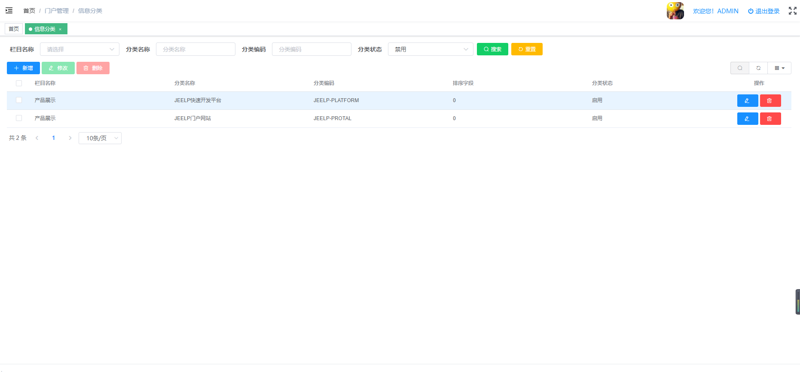
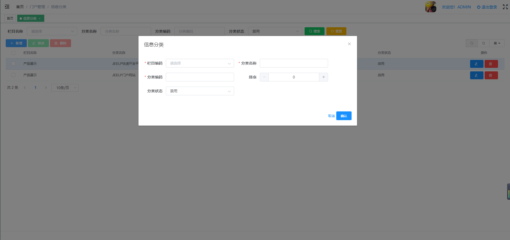

# 信息分类管理
维护门户网站不同栏目下的信息分类。
* 后台代码结构
```
com.jeelp.protal.modules.admin
   .entity
        .InfoCate.java                         信息分类管理数据库映射实体
   .mapper
        .InfoCateMapper.java                   信息分类管理mybaits mapper 映射接口
        .InfoCateMapper.xml                    信息分类管理mybaits mapper 映射xml
   .rest
        .InfoCateController.java               信息分类管理spring mvc 控制器
   .service  
        .impl       
            .InfoCateServiceImpl.java          信息分类管理service 服务实现类
        .InfoCateService.java                  信息分类管理service 服务接口
```
* 前台代码结构
```
src
    api
        pt01admin
            info-cate-api.js                    信息分类管理后端请求api
    views
        pt01admin
            info-cate
                info-cate-form.vue              信息分类管理表单界面
                info-cate-page.vue              信息分类管理列表界面
                info-cate-index.vue             信息分类管理菜单跳转界面
```
* 前后端交换接口说明
    * 后端 InfoCateController.java 
    ```
    package com.jeelp.protal.modules.admin.rest;
    
    import com.jeelp.platform.common.logging.annotation.Log;
    import com.jeelp.platform.common.mybatis.model.SaveModel;
    import com.jeelp.platform.common.mybatis.model.TabPage;
    import com.jeelp.protal.modules.admin.entity.InfoCate;
    import com.jeelp.protal.modules.admin.service.InfoCateService;
    import org.springframework.http.HttpStatus;
    import org.springframework.http.ResponseEntity;
    import org.springframework.web.bind.annotation.*;
    
    import java.util.List;
    import java.util.Map;
    
    /**
    * @Title: InfoCateController.java
    * @Description: TODO 信息分类管理
    * @author 
    * @date 2022-03-19
    * @version V1.0
    */
    @RestController
    @RequestMapping("/admin/infoCate")
    public class InfoCateController {
    
        private final InfoCateService service;
    
        public InfoCateController(InfoCateService service) {
            this.service = service;
        }
    
        @Log("查询【信息分类】")
        @PostMapping(value="page")
        public ResponseEntity<TabPage<InfoCate>> page(@RequestBody Map<String, Object> param) throws Exception{
            return new ResponseEntity(service.selectForPage(param), HttpStatus.OK);
        }
        
        @Log("保存【信息分类】")
        @PostMapping(value="save")
        public ResponseEntity<InfoCate> save(@RequestBody InfoCate entity) throws Exception{
            return new ResponseEntity(service.saveOrUpdate(entity), HttpStatus.OK);
        }
        
        @Log("批量保存【信息分类】")
        @PostMapping(value="batchSave")
        public ResponseEntity<SaveModel<InfoCate>> batchSave(@RequestBody SaveModel<InfoCate> entity){
            return new ResponseEntity(service.batchSaveOrUpdate(entity), HttpStatus.OK);
        }
        
        @Log("删除【信息分类】")
        @DeleteMapping(value="del")
        public ResponseEntity<Object> del(@RequestBody List<Object> ids){
            service.deleteByIds(ids);
            return new ResponseEntity(HttpStatus.NO_CONTENT);
        }
        
        @Log("加载【信息分类】")
        @GetMapping(value="load")
        public ResponseEntity<InfoCate> load(String id){
            return new ResponseEntity(service.selectByPK(id), HttpStatus.OK);
        }
    
    }
    ```
    * 前端 info-cate-api.js
    ```
    import request from '@/utils/request'
    
    export function page(data) {
      return request({
        url: 'admin/infoCate/page',
        method: 'post',
        data
      })
    }
    
    export function save(data) {
      return request({
        url: 'admin/infoCate/save',
        method: 'post',
        data
      })
    }
    
    export function batchSave(data) {
      return request({
        url: 'admin/infoCate/batchSave',
        method: 'post',
        data
      })
    }
    
    export function del(ids) {
      return request({
        url: 'admin/infoCate/del',
        method: 'delete',
        data: ids
      })
    }
    
    export function load(params) {
      return request({
        url: 'admin/infoCate/load',
        method: 'get',
        params: params
      })
    }
    
    export default { page, save, del, load, batchSave }
    ```    
* 管理界面
    * 列表界面
 
        * 功能说明
           * 查询：可根据【信息分类名称】【分类名称】【分类编码】【分类状态】查询信息分类
           * 新增：新增信息分类，弹窗【表单界面】
           * 修改：修改信息分类，弹窗【表单界面】
           * 删除：删除信息分类
    * 表单界面
  
        * 字段说明
            * 栏目名称：当前信息分类所示栏目
            * 分类名称：当前分类名称
            * 分类编码：当前分类有含义的编码
            * 排序： 当前分类排序
            * 分类状态：0-启用，1-禁用，当分类禁用时，当前分类下的信息，不可录入，在门户网站上也不可显示