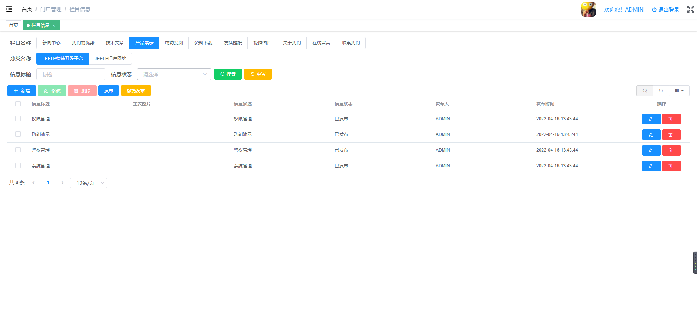
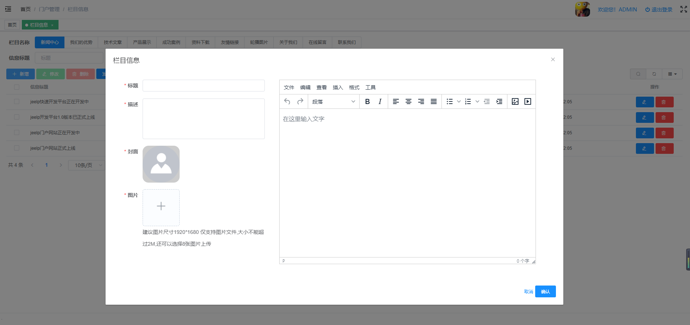
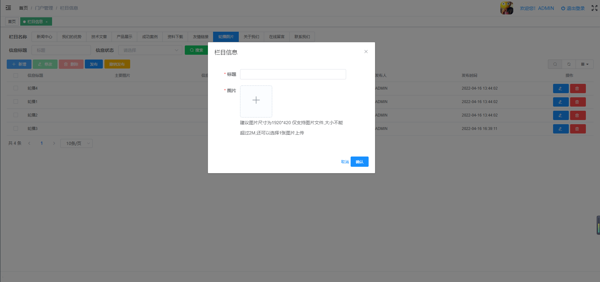
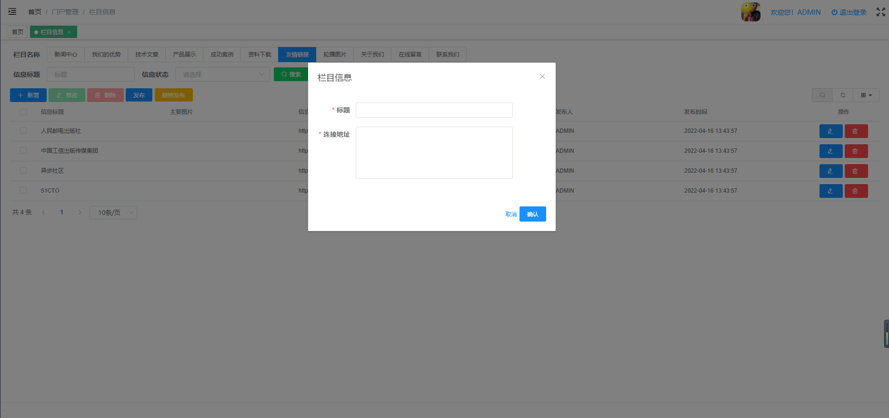
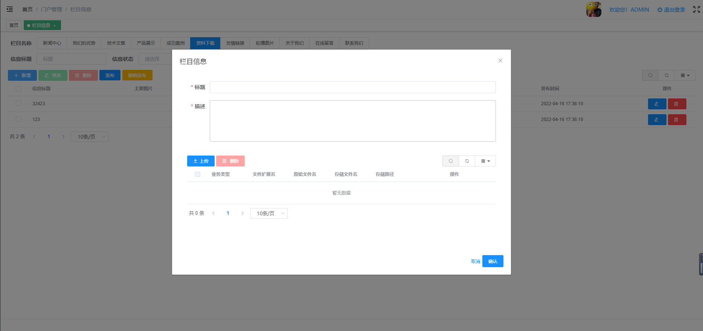

# 栏目信息管理
维护门户网站不同栏目及分类下的信息。
* 后台代码结构
```
com.jeelp.protal.modules.admin
   .entity
        .InfoCate.java                         栏目信息管理数据库映射实体
   .mapper
        .InfoCateMapper.java                   栏目信息管理mybaits mapper 映射接口
        .InfoCateMapper.xml                    栏目信息管理mybaits mapper 映射xml
   .rest
        .InfoCateController.java               栏目信息管理spring mvc 控制器
   .service  
        .impl       
            .InfoCateServiceImpl.java          栏目信息管理service 服务实现类
        .InfoCateService.java                  栏目信息管理service 服务接口
```
* 前台代码结构
```
src
    api
        pt01admin
            topic-Info-api.js                    栏目信息管理后端请求api
    views
        pt01admin
            topic-Info
                topic-Info-form.vue              栏目信息管理默认表单界面
                topic-lbtp-info-form.vue         栏目信息管理轮播图片表单界面
                topic-yqlj-info-form.vue         栏目信息管理友情链接表单界面
                topic-zlxz-info-form.vue         栏目信息管理资料下载表单界面
                topic-upload-page.vue            栏目信息管理资料上传界面
                topic-Info-page.vue              栏目信息管理列表界面
                topic-Info-index.vue             栏目信息管理菜单跳转界面
```
* 前后端交换接口说明
    * 后端 TopicInfoController.java 
    ```
    package com.jeelp.protal.modules.admin.rest;
    
    import com.jeelp.platform.common.logging.annotation.Log;
    import com.jeelp.platform.common.mybatis.model.SaveModel;
    import com.jeelp.platform.common.mybatis.model.TabPage;
    import com.jeelp.protal.modules.admin.entity.TopicInfo;
    import com.jeelp.protal.modules.admin.service.TopicInfoService;
    import org.springframework.http.HttpStatus;
    import org.springframework.http.ResponseEntity;
    import org.springframework.web.bind.annotation.*;
    
    import java.util.List;
    import java.util.Map;
    
    /**
    * @Title: TopicInfoController.java
    * @Description: TODO 栏目栏目信息管理
    * @author 
    * @date 2022-03-19
    * @version V1.0
    */
    @RestController
    @RequestMapping("/admin/topicInfo")
    public class TopicInfoController {
    
    	private final TopicInfoService service;
    
        public TopicInfoController(TopicInfoService service) {
            this.service = service;
        }
    
        @Log("查询【栏目信息】")
    	@PostMapping(value="page")
    	public ResponseEntity<TabPage<TopicInfo>> page(@RequestBody Map<String, Object> param) throws Exception{
    		return new ResponseEntity(service.selectForPage(param), HttpStatus.OK);
    	}
    	
    	@Log("保存【栏目信息】")
    	@PostMapping(value="save")
    	public ResponseEntity<TopicInfo> save(@RequestBody TopicInfo entity) throws Exception{
    		return new ResponseEntity(service.saveOrUpdate(entity), HttpStatus.OK);
    	}
    
    	@Log("批量保存【栏目信息】")
    	@PostMapping(value="batchSave")
    	public ResponseEntity<SaveModel<TopicInfo>> batchSave(@RequestBody SaveModel<TopicInfo> entity){
    	    return new ResponseEntity(service.batchSaveOrUpdate(entity), HttpStatus.OK);
    	}
    	
    	@Log("删除【栏目信息】")
    	@DeleteMapping(value="del")
    	public ResponseEntity<Object> del(@RequestBody List<Object> ids){
    		service.deleteByIds(ids);
    	    return new ResponseEntity(HttpStatus.OK);
    	}
    
        @Log("发布【栏目信息】")
        @PostMapping(value="release")
        public ResponseEntity<Object> release(@RequestBody List<String> ids){
            service.release(ids);
            return new ResponseEntity(HttpStatus.OK);
        }
    
        @Log("撤销发布【栏目信息】")
        @PostMapping(value="back")
        public ResponseEntity<Object> back(@RequestBody List<String> ids){
            service.back(ids);
            return new ResponseEntity(HttpStatus.OK);
        }
    	
    	@Log("加载【栏目信息】")
    	@GetMapping(value="load")
    	public ResponseEntity<TopicInfo> load(String id){
    		return new ResponseEntity(service.selectByPK(id), HttpStatus.OK);
    	}
    
    }
    ```
    * 前端 topic-Info-api.js
    ```
    import request from '@/utils/request'
    
    export function page(data) {
      return request({
        url: 'admin/topicInfo/page',
        method: 'post',
        data
      })
    }
    
    export function save(data) {
      return request({
        url: 'admin/topicInfo/save',
        method: 'post',
        data
      })
    }
    
    export function batchSave(data) {
      return request({
        url: 'admin/topicInfo/batchSave',
        method: 'post',
        data
      })
    }
    
    export function del(ids) {
      return request({
        url: 'admin/topicInfo/del',
        method: 'delete',
        data: ids
      })
    }
    
    export function release(ids) {
      return request({
        url: 'admin/topicInfo/release',
        method: 'post',
        data: ids
      })
    }
    
    export function back(ids) {
      return request({
        url: 'admin/topicInfo/back',
        method: 'post',
        data: ids
      })
    }
    
    export function load(params) {
      return request({
        url: 'admin/topicInfo/load',
        method: 'get',
        params: params
      })
    }
    
    export default { page, save, del, load, release, back, batchSave }
    ```    
* 管理界面
    * 列表界面
 
        * 功能说明
           * 查询：可根据【栏目】【分类】【信息标题】【信息状态】查询栏目信息
              1. 当选择的栏目下存在栏目分类时，才会显示【分类名称】查询条件
           * 新增：新增栏目信息，弹窗【表单界面】
              1. 新增【栏目信息】时，根据选择的【栏目】和【分类】创建【栏目信息】
              2. 新增【栏目信息】时，根据选择的【栏目】上配置的信息类型，弹窗不同的录入表单。
                 * 【栏目】上没有配置【信息类型】，则使用默认表单，填写【栏目信息】
                 * 【栏目】上配置的【信息类型】为LBTP，弹出【轮播图片】表单
                 * 【栏目】上配置的【信息类型】为YQLJ，弹出【友情链接】表单
                 * 【栏目】上配置的【信息类型】为ZLXZ，弹出【资料下载】表单
           * 修改：修改栏目信息，弹窗【表单界面】
           * 删除：删除栏目信息
           * 发布：发布【栏目信息】，将【栏目信息】状态改为【已发布】，只有发布后的【栏目信息】才可以在门户网站上浏览
           * 撤销发布： 撤销已发布的【栏目信息】，将【栏目信息】状态改为【已收回】，撤回发布后，门户网站上将不可浏览该【栏目信息】
    * 表单界面
        * 默认表单
  
        * 字段说明
            * 标题：【栏目信息】标题
            * 描述：【栏目信息】描述
            * 封面： 门户网站【首页】及【二级界面】需要展示的主要图片
            * 图片： 其他图片,这个门户网上没有具体的体现
            * 内容： 富文本编辑，在【门户网上】的详情页展示
        * 轮播图片表单
 
        * 字段说明
            * 标题： 门户网站不体现【标题】
            * 图片： 轮播图片所需要展示的图片
 
         * 字段说明
             * 标题： 友情链接显示文案
             * 链接地址： 点击友情链接浏览器跳转地址
 
          * 字段说明
              * 标题： 标题文案
              * 描述： 资料描述
              * 列表： 资料上传列表
                