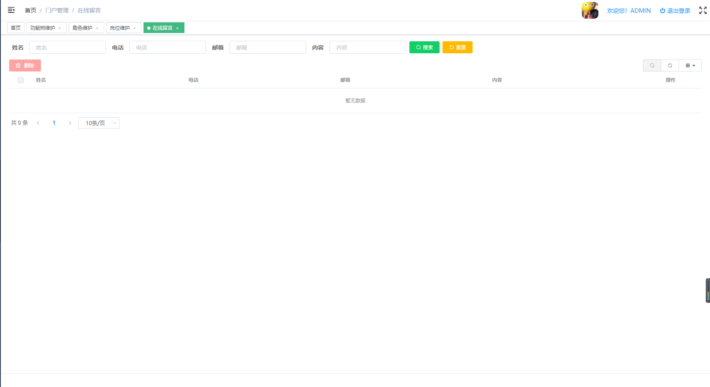

# 在线留言管理
维护门户网站不同栏目及分类下的信息。
* 后台代码结构
```
com.jeelp.protal.modules.admin
   .entity
        .OnlineMsg.java                         在线留言管理数据库映射实体
   .mapper
        .OnlineMsgMapper.java                   在线留言管理mybaits mapper 映射接口
        .OnlineMsgMapper.xml                    在线留言管理mybaits mapper 映射xml
   .rest
        .OnlineMsgController.java               在线留言管理spring mvc 控制器
   .service  
        .impl       
            .OnlineMsgServiceImpl.java          在线留言管理service 服务实现类
        .OnlineMsgService.java                  在线留言管理service 服务接口
```
* 前台代码结构
```
src
    api
        pt01admin
            topic-Info-api.js                    在线留言管理后端请求api
    views
        pt01admin
            topic-Info
                topic-Info-form.vue              在线留言管理默认表单界面
                topic-lbtp-info-form.vue         在线留言管理轮播图片表单界面
                topic-yqlj-info-form.vue         在线留言管理友情链接表单界面
                topic-zlxz-info-form.vue         在线留言管理资料下载表单界面
                topic-upload-page.vue            在线留言管理资料上传界面
                topic-Info-page.vue              在线留言管理列表界面
                topic-Info-index.vue             在线留言管理菜单跳转界面
```
* 前后端交换接口说明
    * 后端 TopicInfoController.java 
    ```
    package com.jeelp.protal.modules.admin.rest;
    
    import com.jeelp.platform.common.logging.annotation.Log;
    import com.jeelp.platform.common.mybatis.model.SaveModel;
    import com.jeelp.platform.common.mybatis.model.TabPage;
    import com.jeelp.protal.modules.admin.entity.TopicInfo;
    import com.jeelp.protal.modules.admin.service.TopicInfoService;
    import org.springframework.http.HttpStatus;
    import org.springframework.http.ResponseEntity;
    import org.springframework.web.bind.annotation.*;
    
    import java.util.List;
    import java.util.Map;
    
    /**
    * @Title: TopicInfoController.java
    * @Description: TODO 栏目在线留言管理
    * @author 
    * @date 2022-03-19
    * @version V1.0
    */
    @RestController
    @RequestMapping("/admin/topicInfo")
    public class TopicInfoController {
    
    	private final TopicInfoService service;
    
        public TopicInfoController(TopicInfoService service) {
            this.service = service;
        }
    
        @Log("查询【在线留言】")
    	@PostMapping(value="page")
    	public ResponseEntity<TabPage<TopicInfo>> page(@RequestBody Map<String, Object> param) throws Exception{
    		return new ResponseEntity(service.selectForPage(param), HttpStatus.OK);
    	}
    	
    	@Log("保存【在线留言】")
    	@PostMapping(value="save")
    	public ResponseEntity<TopicInfo> save(@RequestBody TopicInfo entity) throws Exception{
    		return new ResponseEntity(service.saveOrUpdate(entity), HttpStatus.OK);
    	}
    
    	@Log("批量保存【在线留言】")
    	@PostMapping(value="batchSave")
    	public ResponseEntity<SaveModel<TopicInfo>> batchSave(@RequestBody SaveModel<TopicInfo> entity){
    	    return new ResponseEntity(service.batchSaveOrUpdate(entity), HttpStatus.OK);
    	}
    	
    	@Log("删除【在线留言】")
    	@DeleteMapping(value="del")
    	public ResponseEntity<Object> del(@RequestBody List<Object> ids){
    		service.deleteByIds(ids);
    	    return new ResponseEntity(HttpStatus.OK);
    	}
    	
    	@Log("加载【在线留言】")
    	@GetMapping(value="load")
    	public ResponseEntity<TopicInfo> load(String id){
    		return new ResponseEntity(service.selectByPK(id), HttpStatus.OK);
    	}
    
    }
    ```
    * 前端 topic-Info-api.js
    ```
    import request from '@/utils/request'
    
    export function page(data) {
      return request({
        url: 'admin/topicInfo/page',
        method: 'post',
        data
      })
    }
    
    export function save(data) {
      return request({
        url: 'admin/topicInfo/save',
        method: 'post',
        data
      })
    }
    
    export function batchSave(data) {
      return request({
        url: 'admin/topicInfo/batchSave',
        method: 'post',
        data
      })
    }
    
    export function del(ids) {
      return request({
        url: 'admin/topicInfo/del',
        method: 'delete',
        data: ids
      })
    }
    
    export function load(params) {
      return request({
        url: 'admin/topicInfo/load',
        method: 'get',
        params: params
      })
    }
    
    export default { page, save, del, load, batchSave }
    ```    
* 管理界面
    * 列表界面
 
        * 功能说明
           * 查询：可根据【姓名】【电话】【邮箱】【】查询在线留言