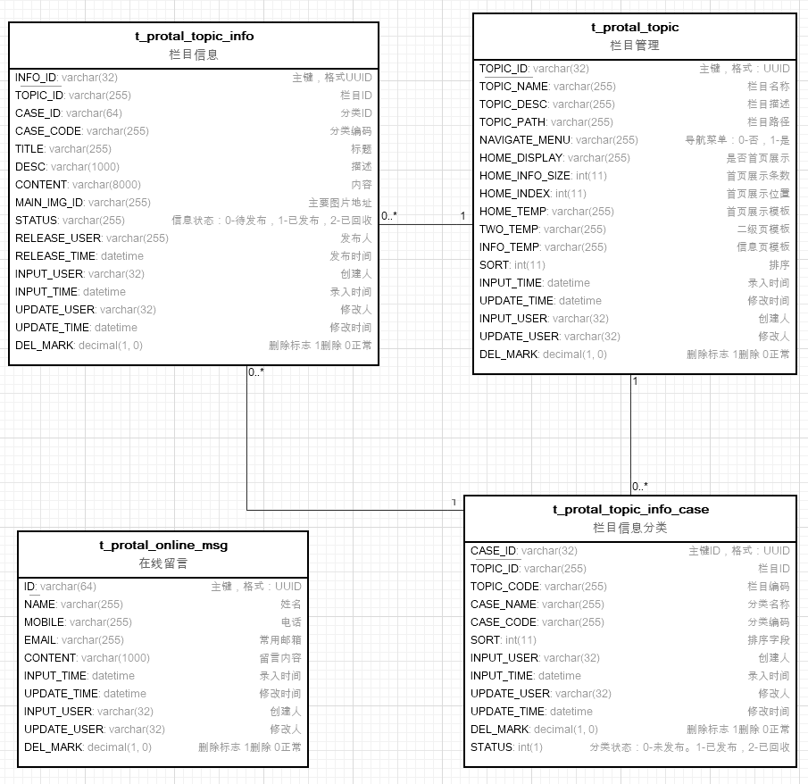

# 数据库er图

# 数据表结构说明
 

- #####T_PROTAL_TOPIC(栏目信息表)
列名 | 类型 | 长度 | 描述
---|---|---|---
TOPIC_ID | varchar | 32 | 主键，格式：UUID
TOPIC_NAME | varchar | 255 | 栏目名称
TOPIC_DESC | varchar | 255 | 栏目描述
TOPIC_PATH | varchar | 255 | 栏目路径
NAVIGATE_MENU | varchar | 255 | 导航菜单：0-否，1-是
HOME_DISPLAY | varchar | 255 | 是否首页展示
HOME_INFO_SIZE | int | 11 | 首页展示条数
HOME_INDEX | int | 11 | 首页展示位置
HOME_TEMP | varchar | 255 | 首页展示模板
TWO_TEMP | varchar | 255 | 二级页模板
INFO_TEMP | varchar | 255 | 信息页模板
SORT | int | 11 | 排序
INPUT_TIME | datetime | 0 | 录入时间
UPDATE_TIME | datetime | 0 | 修改时间（使用）
INPUT_USER | varchar | 32 | 创建人（t_sys_user表的user_id）
UPDATE_USER | varchar | 32 | （末次）修改人（t_sys_user表的user_id）
DEL_MARK | decimal | 1 | 删除标志 1删除 0正常（使用）
 

- #####T_PROTAL_TOPIC_INFO_CASE(信息分类表)
列名 | 类型 | 长度 | 描述
---|---|---|---
CASE_ID | varchar | 32 | 主键，格式：UUID
TOPIC_ID | varchar | 255 | 栏目ID
TOPIC_CODE | varchar | 255 | 栏目编码
CASE_NAME | varchar | 255 | 分类名称
CASE_CODE | varchar | 255 | 分类编码
SORT | int | 11 | 排序字段
INPUT_USER | varchar | 32 | 创建人（t_sys_user表的user_id）
INPUT_TIME | datetime | 0 | 录入时间
UPDATE_USER | varchar | 32 | （末次）修改人（t_sys_user表的user_id）
UPDATE_TIME | datetime | 0 | 修改时间（使用）
DEL_MARK | decimal | 1 | 删除标志 1删除 0正常（使用）
STATUS | int | 1 | 分类状态：0-未发布。1-已发布，2-已回收

 

- #####T_PROTAL_TOPIC_INFO(栏目信息表)
列名 | 类型 | 长度 | 描述
---|---|---|---
INFO_ID | varchar | 32 | 主键，格式：UUID
TOPIC_ID | varchar | 255 | 栏目ID
CASE_ID | varchar | 64 | 分类ID
CASE_CODE | varchar | 255 | 分类编码
TITLE | varchar | 255 | 标题
DESC | varchar | 1000 | 描述
CONTENT | varchar | 8000 | 内容
MAIN_IMG_ID | varchar | 255 | 主要图片地址
STATUS | varchar | 255 | 信息状态：0-待发布，1-已发布，2-已回收
RELEASE_USER | varchar | 255 | 发布人
RELEASE_TIME | datetime | 0 | 发布时间
INPUT_USER | varchar | 32 | 创建人（t_sys_user表的user_id）
INPUT_TIME | datetime | 0 | 录入时间
UPDATE_USER | varchar | 32 | （末次）修改人（t_sys_user表的user_id）
UPDATE_TIME | datetime | 0 | 修改时间（使用）
DEL_MARK | decimal | 1 | 删除标志 1删除 0正常（使用）

 

- #####T_PROTAL_ONLINE_MSG(在线留言表)
列名 | 类型 | 长度 | 描述
---|---|---|---
ID | varchar | 64 | 主键
NAME | varchar | 255 | 姓名
MOBILE | varchar | 255 | 电话
EMAIL | varchar | 255 | 常用邮箱
CONTENT | varchar | 1000 | 留言内容
INPUT_TIME | datetime | 0 | 录入时间
UPDATE_TIME | datetime | 0 | 修改时间（使用）
INPUT_USER | varchar | 32 | 创建人（t_sys_user表的user_id）
UPDATE_USER | varchar | 32 | （末次）修改人（t_sys_user表的user_id）
DEL_MARK | decimal | 1 | 删除标志 1删除 0正常（使用）
